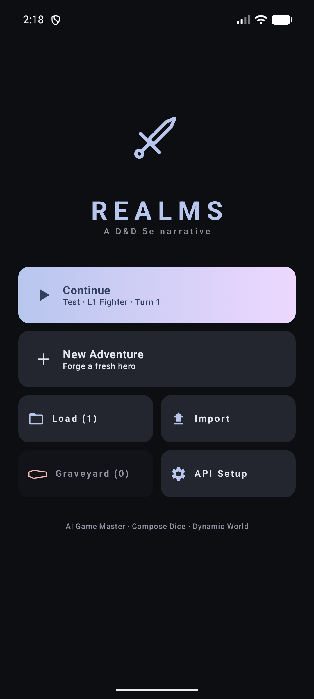
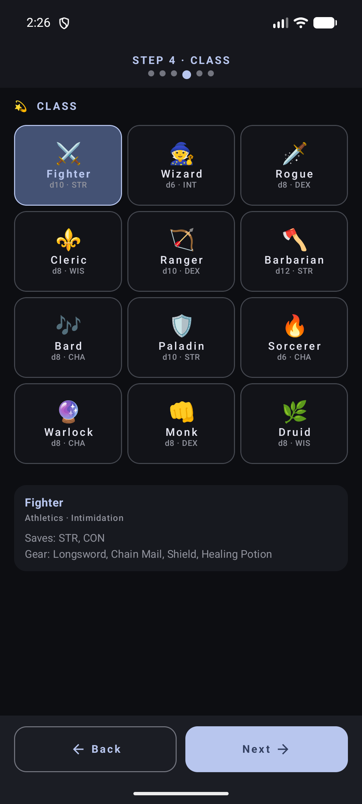
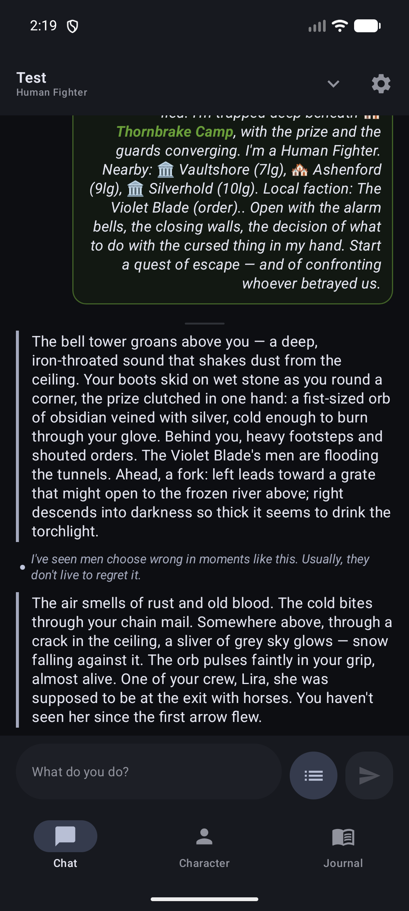
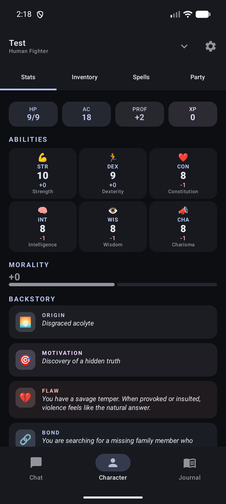
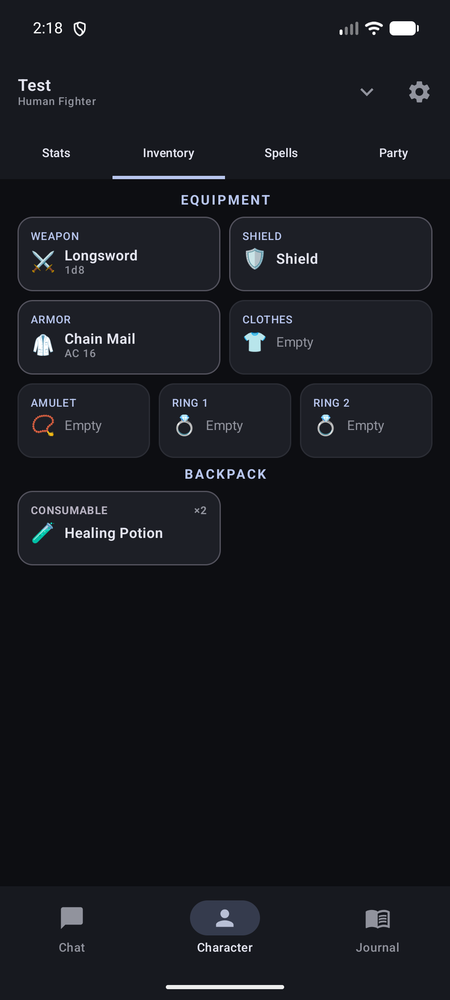
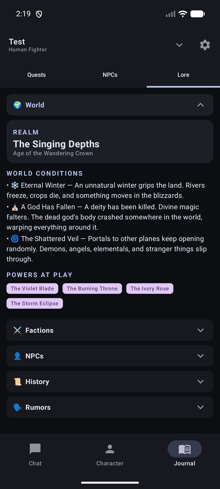

<div align="center">

# ⚔️ Realms

### A native Android RPG where every adventure is narrated by an AI Dungeon Master.

Kotlin · Jetpack Compose · D&D 5e · DeepSeek V3

[](https://github.com/tahuffman1s/Realms-Android/releases)
[](https://developer.android.com/)
[](https://kotlinlang.org/)
[](https://developer.android.com/jetpack/compose)
[](LICENSE)



</div>

---

## 🎲 What is this?

You type what your character does. The AI narrates what happens next — rolling dice, tracking NPCs, advancing quests, and mutating the world behind the scenes. A structured tag protocol (`[DAMAGE:N]`, `[QUEST_START:…]`, `[NPC_MET:…]`) bridges the AI's prose with real game mechanics. HP, inventory, faction reputation, and 20+ other state variables update automatically each turn.

The narrator is modeled after Baldur's Gate 3: sardonic, omniscient, willing to let you fail spectacularly. Asides like *"Well, that was genuinely painful to watch"* appear between prose blocks as the story plays out.

---

## ✨ Features

| | |
|---|---|
| 🧙 **AI Game Master** | DeepSeek V3 narrates turn-by-turn with prompt caching that saves 70%+ of tokens after the first turn. |
| 🌍 **Procedural worlds** | Seeded, deterministic worlds with 11–14 locations, 2–4 factions, 300+ NPC names, and a full historical timeline. |
| ⚔️ **D&D 5e mechanics** | 11 races · 12 classes · point-buy abilities · proficiency scaling · 34-entry spell database · skill checks · death saves. |
| 🎒 **Deep equipment** | Weapon, shield, armor, amulet, clothes, two rings — each with effects on AC, HP, abilities, skills, resistances, and on-hit triggers. |
| 🏛️ **Lore & mutations** | 2–3 world mutations per run from a pool of 16 — *The Dead Walk*, *Eternal Winter*, *Dragon Tyranny*, *Fey Crossing* — each rewriting how the narrator frames every scene. |
| ⚖️ **Morality & reputation** | Morality tracked from -100 to +100 across 7 tiers. Per-faction reputation colors NPC reactions and available choices. |
| 💾 **Persistent NPCs** | Stable slug IDs survive 100+ turns. Dialogue history, memorable quotes, relationships, location awareness — all round-trip through the save format. |
| 🎨 **Material You** | Dynamic color on Android 12+, day/night palette, Cinzel + Crimson serif typography. |

---

## 📸 Screens

<table>
<tr>
<td width="33%"><br/><sub><b>Class selection</b> · 12 classes with starting gear</sub></td>
<td width="33%"><br/><sub><b>Narrator</b> · prose + asides between scene beats</sub></td>
<td width="33%"><br/><sub><b>Character sheet</b> · stats, morality, backstory</sub></td>
</tr>
<tr>
<td width="33%"><br/><sub><b>Inventory</b> · 7 equipment slots + effects</sub></td>
<td width="33%"><br/><sub><b>World lore</b> · realm, mutations, factions</sub></td>
<td width="33%"><br/><sub><b>Title</b> · continue, new, import, graveyard</sub></td>
</tr>
</table>

---

## 🧠 Prompt engineering

The AI integration is the core of the game. Key design decisions:

- **Prompt caching** — The system prefix (`DS_PREFIX` + `SYS` + world palette) is stable across turns. Dynamic state lives in the user message, so DeepSeek's cache hits the full prefix every turn.
- **Structured output** — A `[METADATA]{JSON}` block carries all mechanical state (damage, XP, items, NPC updates, quest changes). A regex fallback exists as a safety net — and hasn't fired in production.
- **Skill classification** — Freeform player actions get a lightweight pre-call: *"What D&D 5e skill fits this?"* Returns a skill name for the d20 check, or `null` if none is needed.
- **Per-turn reminder** — A short trailer appended to the last user message reinforces tag structure, narrative voice, and mechanical rules late in long conversations.

---

## 🛠️ Tech stack

| Layer | Choice |
|---|---|
| Language | Kotlin 2.2 |
| UI | Jetpack Compose · Material 3 · Material You dynamic color |
| Architecture | Single `ComponentActivity` · `GameViewModel` with `StateFlow` · pure reducers |
| AI | DeepSeek V3 via OkHttp (Gemini + Claude supported but dormant) |
| Persistence | DataStore prefs · JSON save slots via `kotlinx.serialization` · per-save Room DB |
| Target | SDK 34 (Android 14) · min SDK 26 (Android 8) |

---

## 🚀 Getting started

**Requirements:** Gradle 9.4+ · AGP 9.0 · Kotlin 2.2 · Android SDK 34 · JDK 17+

```bash
# First-time setup
cp local.properties.sample local.properties
# Edit local.properties: sdk.dir=/path/to/Android/Sdk

# Build & install
gradle assembleDebug     # app/build/outputs/apk/debug/app-debug.apk
gradle assembleRelease   # needs signing config (see .cursor/rules/releases-signing.mdc)
gradle lint
gradle test
```

### First run

1. Launch the app.
2. Pick a provider and paste your API key (stored on-device via DataStore).
3. Create a character — race, class, abilities, appearance.
4. The narrator takes over.

---

## 🗂️ Project layout

```
app/src/main/kotlin/com/realmsoffate/game/
├── data/          Models, AI repo, prompts, envelope parser, save/prefs
├── game/          GameViewModel · reducers · handlers · world/lore gen · classes/races
├── ui/            theme · setup · game · panels · overlays · dice
└── util/          Markdown, helpers
```

Full rules and workflow for contributors live in **`CLAUDE.md`** and **`.cursor/rules/*.mdc`** (debug-bridge procedures, testing policy, release/signing, auto-tagger rules).

---

## 🧪 Testing

Integration tests cover the per-turn state-mutation pipeline via Robolectric:

- `ApplyParsedIntegrationTest` — tests across all reducer domains
- `EquipmentEffectsTest` · `PromptSummaryTest` · `EnvelopeParserTest` · `SceneSummaryTest`
- `GameStateFixture` + `ParsedReplyBuilder` — harness for constructing game state and AI responses

Run with `gradle test`.

---

## 🗺️ Roadmap

See **[ROADMAP.md](ROADMAP.md)** for shipped phases, pending work, and strategic concerns. Highlights:

- **AI Reliability** (Phases 1–4 shipped) — prompt caching, stable NPC IDs, JSON metadata, few-shot polish
- **Parser** (Phases A–B shipped) — tokenizer + stack parser replacing regex
- **GameViewModel Refactor** (Phases I–III shipped) — reducer extraction, handler extraction, `applyParsed` from 528 → ~140 lines
- **Equipment Effects** (shipped) — `ItemEffect` sealed interface, `EquipmentEffects` aggregator, narrator integration

---

## 📄 License

MIT — see [LICENSE](LICENSE).
